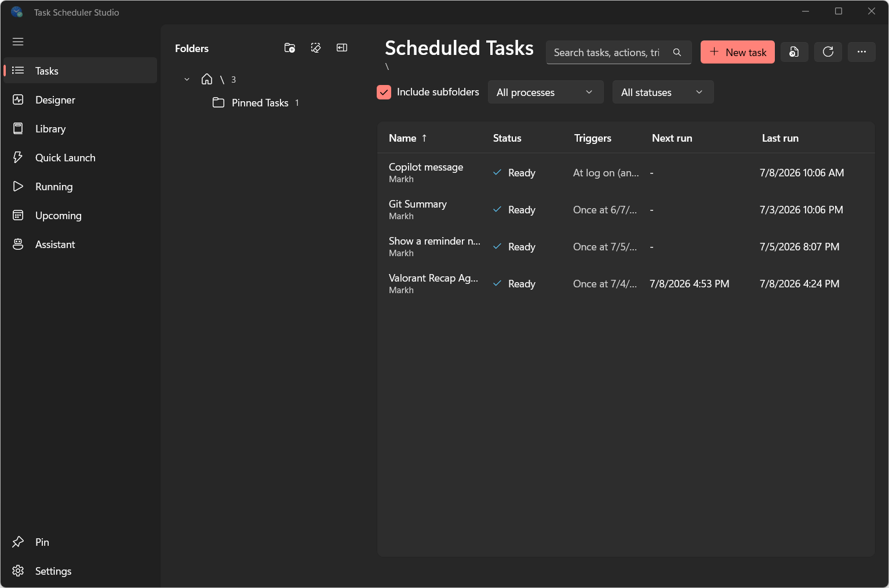

<h1 align="center">
  <a href="https://apps.microsoft.com/detail/9N0FV2HZXKJG"><br></a>
  Task Scheduler Studio
</h1>

<h4 align="center">A modern, Fluent WinUI 3 reimagining of Windows Task Scheduler, with natural-language task creation and a local MCP server for AI agents.</h4>
<p align="center"> 
  <a href="https://apps.microsoft.com/detail/9n0fv2hzxkjg?referrer=appbadge&mode=full" target="_blank"  rel="noopener noreferrer">
	</a>
</p>
<p align="center">
    <a href="#overview">Overview</a> •
  <a href="#installation">Installation</a> •
  <a href="#solution-layout">Solution layout</a> •
  <a href="#script-library">Script library</a> •
  <a href="#build--run">Build &amp; run</a> •
  <a href="#the-mcp-server">MCP server</a> •
  <a href="#license">License</a>
</p>

---




## Overview

Task Scheduler Studio is a modern WinUI 3 reimagining of the built-in Windows Task Scheduler. It reads and writes the live Windows Task Scheduler store through the Task Scheduler V2 COM API, so everything you create is a normal scheduled task: visible in `taskschd.msc`, queryable with `schtasks`, and fully interoperable with the built-in tool. There is no separate database — create a task in either tool and it appears, runs, and edits identically in the other.

The app pairs that engine with a clean Fluent interface and, optionally, AI. A built-in GitHub Copilot assistant lets you create and manage tasks in plain English, and a bundled local MCP server exposes the same engine to your favorite AI agents, so both the UI and agents always behave identically.

> **Disclaimer:** Task Scheduler Studio was created by a Microsoft employee as an individual personal
> project and proof of concept. It is **not** an official Microsoft product, service, or offering,
> and it is **not affiliated with, endorsed by, or supported by Microsoft**. All work and opinions
> are the developer's own.

<sub>This project was built with the help of AI coding tools (GitHub Copilot).</sub>

## Installation
Method 1: Directly from the Microsoft Store [HERE](https://apps.microsoft.com/detail/9N0FV2HZXKJG)

Method 2: Downloading and installing the Store MSIX package directly from the latest GitHub release [HERE](https://github.com/MarkHopper24/Task-Scheduler-Studio/releases/latest) 

Method 3: From Windows Package Manager using winget via command line
```
winget install "Task Scheduler Studio" --source msstore
```

For now, WinTask Scheduler requires an internet connection on installation for license acquisition through the Microsoft Store (this includes the build hosted in this repository). After first installation, it can be used fully offline.

Method 4: Building the solution on your own in Visual Studio using the provided source code (this method does not require a network connection).


## Cross-compatible with Task Scheduler

Task Scheduler Studio talks to the **Task Scheduler V2 COM API** (`Schedule.Service`) through the mature
`Microsoft.Win32.TaskScheduler` managed wrapper. That is the *same* API and the *same* task store
the built‑in Task Scheduler uses — there is no separate database. Anything Task Scheduler Studio creates is
a normal scheduled task: visible in `taskschd.msc`, queryable with `schtasks`, and backed by the
standard Task Scheduler XML interchange format (Import/Export compatible).

## Solution layout

| Project | Type | Purpose |
|---------|------|---------|
| `Tasker.Core` | class library | The single source of truth: `TaskerService` wraps the COM API and exposes serializable DTOs (folders, tasks, triggers, actions, settings). |
| `Tasker.App` | WinUI 3 app | The desktop UI — folder tree, searchable task table, rich detail pane, a tabbed create/edit editor with a raw‑XML escape hatch, and a natural‑language **Copilot assistant**. |
| `Tasker.Mcp` | console app | A local stdio **MCP** server exposing the same engine to agents. |

Because the UI and the MCP server both call into `Tasker.Core`, they always behave identically.

## Script library

The **Library** page offers ~20 ready-made, safe PowerShell automation scripts (cleanup, backup,
maintenance, monitoring, and system tasks) plus your own saved scripts. Each built-in script opens with
a clearly-commented **settings block** for easy tweaks, exposed as friendly inputs in the preview. When
you pick **Create task**, the (possibly edited) script is written to a real `.ps1` under
`%LOCALAPPDATA%\WindowsTasker\scripts` and handed to the visual **Designer** as a pre-built action, so
you just choose a schedule. You can also add a script mid-flow from the Designer's **Add action →
From script library**.

- **Safe by design:** deletions of your files go to the Recycle Bin; only transient caches/temp are
  hard-deleted (scoped, best-effort). Every script runs `-NoProfile -ExecutionPolicy Bypass` and is
  shown for review before a task is created. Scripts that need elevation are flagged and switch on
  "Run with highest privileges".
- **Notifications:** the reminder and low-disk-space scripts raise real **Windows 11 toasts** without
  installing a module or registering an app (they borrow Task Scheduler Studio's own AUMID, falling back
  to File Explorer's).
- **Your own scripts:** create, edit, duplicate (from a built-in), and delete your scripts; they are
  stored as JSON at `%LOCALAPPDATA%\WindowsTasker\script-library.json`.

## Create tasks with natural language (GitHub Copilot SDK)

The **Assistant** page embeds the official [GitHub Copilot SDK](https://github.com/github/copilot-sdk)
(`GitHub.Copilot.SDK`). Describe what you want in plain English — *"run backup.cmd every weekday at
6pm"* — and the Copilot agent runs a guided flow: it asks for anything that's missing (name, the
program to run, the schedule), confirms, then calls the Task Scheduler Studio tools (`create_task`,
`create_task_from_xml`, `list_folders`, `list_tasks`) — the **same tools the MCP server exposes**,
backed by the shared engine — to write the task into the live Windows store.

- **Authentication:** click **Sign in with GitHub** on the Assistant page — it uses the GitHub CLI
  (`gh`) to authenticate interactively, reusing an existing `gh` session when present or opening the
  GitHub web sign-in otherwise. You can also paste a GitHub token, or just start chatting to use your
  existing Copilot session. A Copilot subscription is required.
- **Locked down:** the assistant is hardened on multiple layers — a dedicated **AGENTS.md** and
  system prompt restrict it to scheduled-task work, and a strict **permission handler** allows ONLY
  the Task Scheduler Studio task tools to execute, rejecting shell, file, web, memory and every other
  built-in capability (verified: a jailbreak prompt asking it to run a shell command was refused and
  nothing happened). Tool inputs are validated, and destructive actions require confirmation.
- **Suggested prompts:** quick chips like *Scan tasks for red flags* (runs `analyze_task` over your
  tasks and reports evidence-based findings), *What runs at startup?*, and *Run Notepad daily*.

## Build & run

Prerequisites: Windows 10 1903+, .NET 10 SDK, Developer Mode, and the `winapp` CLI
(`winget install Microsoft.WinAppCli`).

```powershell
# Build everything
dotnet build WinTaskScheduler.slnx -c Debug

# Run the desktop app (uses the WinUI dev workflow helper)
cd Tasker.App
./BuildAndRun.ps1          # or: winapp run <build-output-folder>
```

> **Elevation:** Creating tasks that *Run with highest privileges*, or editing protected system
> tasks under `\Microsoft\Windows\…`, requires running Task Scheduler Studio (or the MCP server) **as
> administrator** — exactly like the built‑in tool. Everyday per‑user tasks work without elevation.

## The MCP server

`Tasker.Mcp` speaks the Model Context Protocol over stdio (newline‑delimited JSON‑RPC 2.0).

### Tools

| Tool | Description |
|------|-------------|
| `list_folders` | The Task Scheduler folder tree with task counts. |
| `list_tasks` | Tasks in a folder (optionally recursive / filtered) with state, next/last run, result, and trigger/action summaries. |
| `get_task` | Full definition of one task incl. raw XML. |
| `export_task_xml` | Portable Task Scheduler XML for a task. |
| `analyze_task` | **Grounded, evidence-based assessment** of a task — a risk level plus findings that each cite the exact command/trigger/principal/setting they're based on (e.g. encoded PowerShell, download-and-run, runs from a user-writable path, hidden+elevated+autostart). |
| `run_task` / `stop_task` | Start / end a task on demand. |
| `enable_task` / `disable_task` | Toggle a task. |
| `delete_task` | Permanently delete a task. |
| `get_running_tasks` | Currently running instances (with engine PID). |
| `create_task` | Create or update a task from structured `triggers`+`actions` **or** raw `xml`. |

### Register it with an MCP client

**Easiest:** open the app's **About** page and click **Install for Copilot CLI** or **Install for
VS Code** — each merges a `wintask-scheduler` entry into the right config file (preserving anything
already there) pointing at the bundled server. Restart the CLI/editor afterward.

To do it manually, set the MCP client's launch command. **When the app is installed** (from the
Microsoft Store or an MSIX package) the real install folder lives under the protected
`C:\Program Files\WindowsApps\...`, which other processes generally can't reach reliably. The app
works around this by copying its bundled server, on every launch, to a normal per-user folder at
`%LOCALAPPDATA%\WindowsTasker\mcp\Tasker.Mcp.exe` and pointing MCP clients there instead; that's the
exact command the one-click installers write and the one shown on the About page. A stable
app-execution alias, `WinTaskSchedulerMcp.exe` (resolved from `%LOCALAPPDATA%\Microsoft\WindowsApps`
on `PATH`), is also registered as a fallback if staging can't run for some reason. For an
**unpackaged dev run**, use the absolute path to the built `Tasker.Mcp.exe`.

**GitHub Copilot CLI** — `~/.copilot/mcp-config.json`:

```json
{
  "mcpServers": {
    "wintask-scheduler": {
      "type": "stdio",
      "command": "%LOCALAPPDATA%\\WindowsTasker\\mcp\\Tasker.Mcp.exe",
      "args": [],
      "tools": []
    }
  }
}
```

The one-click installers write this staged path automatically (expanded to the real folder, not
the literal `%LOCALAPPDATA%` text). For an unpackaged dev build, replace the command with the
absolute path to the built server, e.g.
`Tasker.App\bin\x64\Debug\net10.0-windows10.0.26100.0\win-x64\mcp\Tasker.Mcp.exe`.

**VS Code** (Agent mode) — `%APPDATA%\Code\User\mcp.json` (or per-workspace `.vscode/mcp.json`):

```json
{
  "servers": {
    "wintask-scheduler": {
      "type": "stdio",
      "command": "%LOCALAPPDATA%\\WindowsTasker\\mcp\\Tasker.Mcp.exe",
      "args": []
    }
  }
}
```

**Claude Code** — `~/.claude.json` (user-scoped, applies across projects):

```json
{
  "mcpServers": {
    "wintask-scheduler": {
      "type": "stdio",
      "command": "%LOCALAPPDATA%\\WindowsTasker\\mcp\\Tasker.Mcp.exe",
      "args": [],
      "env": {}
    }
  }
}
```

**Generic / other clients** — any MCP host that launches a local stdio server works:

```json
{
  "mcpServers": {
    "wintask-scheduler": {
      "command": "dotnet",
      "args": ["run", "--project", "D:\\Windows Tasker\\Tasker.Mcp\\Tasker.Mcp.csproj", "-c", "Debug"]
    }
  }
}
```

### Example agent call

```jsonc
// tools/call create_task
{
  "name": "Nightly backup",
  "folder": "\\MyApps",
  "description": "Runs the backup script every night",
  "principal": { "runWithHighestPrivileges": false },
  "triggers": [
    { "kind": "daily", "startBoundary": "2026-01-01T02:00:00", "daysInterval": 1 }
  ],
  "actions": [
    { "command": "C:\\Scripts\\backup.cmd", "arguments": "--full" }
  ]
}
```

The structured editor and `create_task` understand the common trigger kinds (`oneTime`, `daily`,
`weekly`, `monthly`, `atStartup`, `atLogOn`, `onIdle`). For anything else — event triggers, COM
handler actions, exotic settings — pass full **raw XML** (UI: *Advanced* tab; MCP: the `xml` field),
which is registered verbatim for 100% fidelity.

## Quality-of-life extras (beyond the built-in Task Scheduler)

- **Natural-language task creation & management** via the Copilot assistant — it can also run,
  enable/disable, delete, and answer questions about your tasks ("what runs at startup?").
- **Run History** — per-task event log (from `Microsoft-Windows-TaskScheduler/Operational`) in the
  detail pane.
- **Folder picker** when creating/editing, plus **create/delete folders** from the tree toolbar.
- **Duplicate task**, and **templates** ("New task" ▾) for common recipes.
- **Sortable columns** (click a header) and **live search** across name, action, trigger, author.
- **Multi-select bulk actions** — run / enable / disable / delete several tasks at once.
- **Rich trigger editor** — one-time, daily, weekly, monthly (by day), monthly (by day-of-week),
  at startup, at logon, on idle, on an event, on session state change, plus repetition and expiry.
- **Run as a different user** — interactive, stored-password, S4U, or SYSTEM.
- **Backup / restore** a whole folder of tasks as a zip of XML.
- **Upcoming runs** view (everything sorted by next run time) and **toast notifications** when a
  task you started finishes.
- **Restart as administrator** for elevated operations; **auto-refresh** when the assistant changes
  tasks; **markdown-rendered** assistant replies.
- **Appearance** (About page) — switch the window **backdrop** (Mica Alt · Mica · Acrylic) and the
  **theme** (System · Light · Dark); choices persist across restarts.
- **Resizable details pane** — drag the splitter on the Tasks page to grow the inspection/XML area.

## Tests

`ui-tests.ps1` drives the running app through `winapp ui` automation (navigation, the editor, an
end‑to‑end create verified against `schtasks`, and an AutomationId accessibility audit):

```powershell
./ui-tests.ps1 -AppPid <pid-of-running-app>
```

## License

Task Scheduler Studio's own source code is released under the **MIT License** — see
[`LICENSE`](LICENSE). It depends only on permissive (MIT) libraries plus the
Microsoft Windows App SDK / Windows SDK build tools, which Microsoft's license
terms allow redistributing inside applications you build. Third-party components
and their licenses are listed in [`THIRD-PARTY-NOTICES.md`](THIRD-PARTY-NOTICES.md).

## Privacy

The app runs locally and the developer collects no personal data. Optional
features (the GitHub Copilot assistant and GitHub sign-in) send data only to
GitHub when you choose to use them. See [`PRIVACY.md`](PRIVACY.md) for the full
privacy policy.
